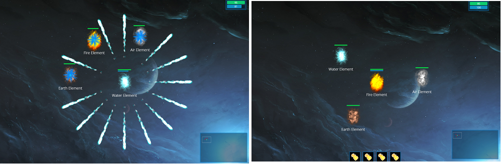

# real-time-multiplayer-game
A simple but powerful real-time multiplayer game built with socket.IO and HTML5 canvas on top of NodeJS.

## Networking
Although packets are being transmited over TCP, the game runs smoothly thanks to the "Entity Interpolation" algorithm explained here: https://developer.valvesoftware.com/wiki/Source_Multiplayer_Networking.
Due to javascript's unreliable "setInterval" function, some tricks had to be performed in order for the game to be updated at regular time intervals.

## Usage
I built this game to learn multiplayer networking using Node.js as backend.
To see it in action first:

1. npm install
2. npm start

This will start a local server on port 8080.
Use multiple browser windows to test its multiplayer features.

## Game mechanics
This is a simple game in Agar.io's style.
There are 4 elements to choose from with different abilities.

Move around using the mouse. Stay in place by holding 'Space'. Lock direction with 'Shift'. 
1. Shoot fireballs using 'Q'. 
2. Perform AOE ability with 'W'
3. Activate buff with 'E'
4. Trigger Ultimata with 'R'
